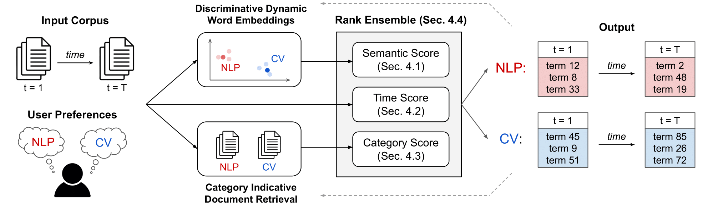

# DynaMiTE: Discovering Explosive Topic Evolutions with User Guidance

This repository is the official implementation of "DynaMiTE: Discovering Explosive Topic Evolutions with User Guidance", which was accepted to Findings of ACL 2023



## Datasets

The datasets used in our experiments can be found on Huggingface [here](nbalepur/DynaMiTE)! There are three splits in the dataset: `arxiv`, `un`, and `newspop`, which correspond to the three datasets used in the paper. Each dataset also has two columns:
- `text`: The text of the document in the corpus
- `time_discrete`: The time stamp of the document in the corpus

## Requirements

This code was run on Python 3.8.10. We recommend creating a [virtual environment](https://docs.python.org/3/library/venv.html) to run `DynaMiTE`.

To install requirements:

```setup
pip install -r requirements.txt
```

## Preprocessing

First, create a folder with your dataset name in the `data` folder (e.g. `data/arxiv`). To load in your dataset, create a `data.csv` file where each row is a document. This CSV must contain at least two columns, `text` and `time_discrete`, which correspond to the text of the document as well as an ordinal integer representing the time step of the document.

The zip file containing AutoPhrase must also be downloaded from [here](https://github.com/yumeng5/CatE/blob/master/preprocess/AutoPhrase.zip). This zip file should be moved into the  `preprocessing` folder.

To preprocess the dataset, navigate to `/preprocess/`, specify the parameters at the top of the `preprocess.py` file, and run the following command:

```preprocess
python preprocess.py
```

The folder with your CSV will become populated with more data. Expect ~15min to process each dataset.

We provide links to download the [Arxiv](https://www.kaggle.com/datasets/Cornell-University/arxiv), [UN](https://www.kaggle.com/datasets/unitednations/un-general-debates), and [Newspop](https://huggingface.co/datasets/newspop) datasets.

## Training

First, navigate to `train_model/train.py` and specify your parameters at the top of the file. Then, navigate back to parent directory.

You can train `DynaMiTE` by running the following command:

```train
python train_model/train.py
```

You must specify an output folder, which defaults to the `results` folder. You must also add the same dataset folder to the output folder specified in the preprocessing step (e.g. `results/arxiv/`). After training, the specified output folder will be populated with the topic evolutions in a text file, along with the embeddings from the discriminative dynamic word embedding space.
## Experiments

We include code for running quantitative experiments for NPMI and the category shift analysis. Both experiments require the outputs from training.

You can calculate NPMI by running the following command:

```npmi
python eval.py
```

You can run the category experiment through the following command:

```shift
python shift_study.py
```
